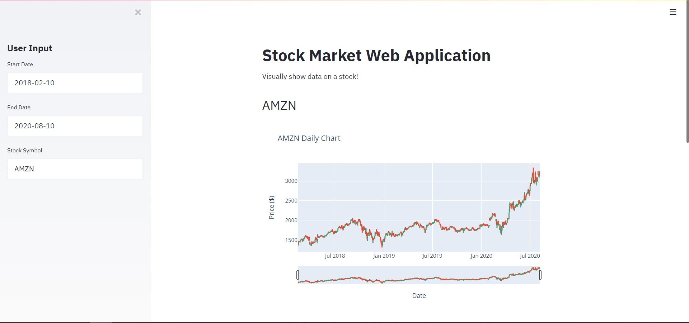
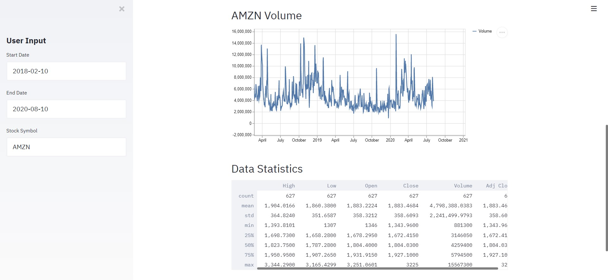

# Stock-Web-Application

Web application that displays stock charts.

## Purpose

The goal of this project is to try to use the python library [streamlit](https://docs.streamlit.io/en/stable/index.html).

## Functionalities

This program allows to observe:

- the stock charts (candle chart)
- the volumes (line chart)
- some specific data like: _mean, min, std, 25%_

## What I've learned

I've learned how to use:

- streamlit (basic level), inserting graphs and text input.
- dataframes and how to show them through a graph
- [anaconda](https://www.anaconda.com/)

## How the project looks like

